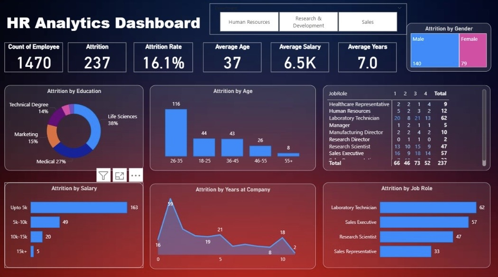

# 💼 HR Analytics Dashboard (Power BI)

## 📊 Overview
This project focuses on analyzing employee attrition data to identify key patterns and insights that help HR teams improve retention strategies.  
The process involved data cleaning, exploratory data analysis (EDA), and interactive visualization using Power BI.

---

## 🧩 Dataset
- **Source:** HR employee dataset (CSV format)  
- **Rows:** 1,470  
- **Key Columns:** Employee Age, Salary, Education, Department, Job Role, Years at Company, Attrition  
- **Purpose:** To understand factors contributing to employee attrition such as salary levels, experience, and education.

---

## 🛠 Tools & Technologies
- **Microsoft Excel** – Data cleaning and preprocessing  
- **Power BI** – Data visualization and dashboard creation  

---

## 🔍 Steps Performed

### 1. Data Cleaning
- Removed duplicates and handled missing values  
- Standardized column names and data formats  
- Ensured consistency across numeric and categorical fields  

### 2. Exploratory Data Analysis (EDA)
- Analyzed attrition patterns by age, gender, education, salary, and job role  
- Calculated overall attrition rate and average employee metrics  
- Identified top departments and roles with the highest turnover  

### 3. Dashboard Development (Power BI)
- Imported cleaned data into Power BI  
- Created KPIs for attrition count, rate, average salary, and tenure  
- Designed interactive charts and slicers for easy exploration  

---

## 📈 Dashboard Insights
- **Total Employees:** 1,470  
- **Attrition Count:** 237 (16.1%)  
- **Average Age:** 37 years  
- **Average Salary:** $6.5K  
- **Average Tenure:** 7 years  

### Key Findings:
- Highest attrition occurs among employees aged 26–35  
- Employees from Technical and Medical fields show higher turnover  
- Laboratory Technicians and Sales Executives have the most attrition cases  
- Attrition is higher among employees earning below $5K/month  

---

## 🖼 Dashboard Preview

---

## 🚀 How to Use
1. Download the `.pbix` file  
2. Open it in **Power BI Desktop**  
3. Explore interactive visuals and filters to uncover insights  

---

## 📬 Author
**Sneha Nagpal**  
*Data Analyst | Power BI | Excel*  
📧 [nsneha2301@gmail.com]  
🔗 [LinkedIn Profile](http://linkedin.com/in/snehanagpal)
